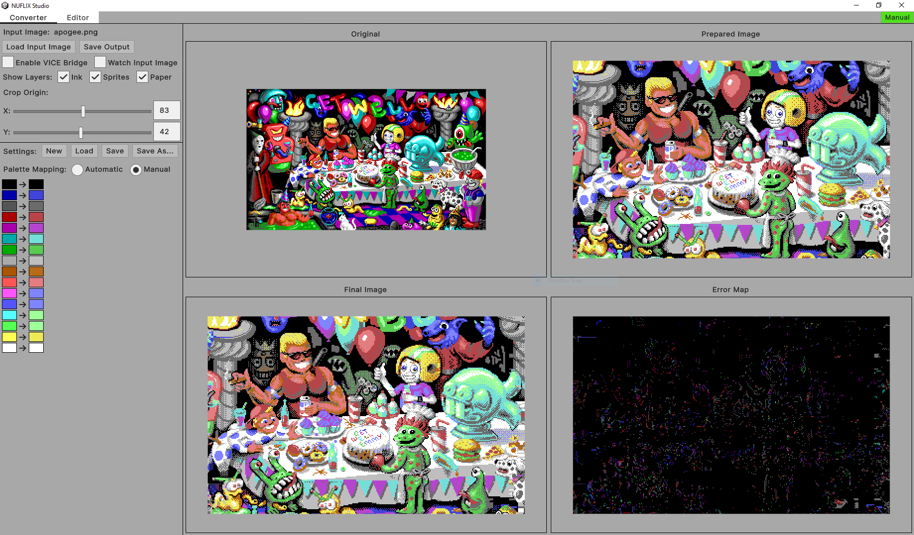

# NUFLIX Studio Manual

## Overview

NUFLIX Studio is a system for creating full-screen high-resolution art for the C64 with as much colour as the hardware allows. The name NUFLIX stands for "NUFLI eXtended", as this format is an incremental evolution from [NUFLI](https://www.c64-wiki.com/wiki/NUFLI). The system consists of two main components: a converter and an editor.

The recommended workflow is to create an image, preferably 320x200 and using the C64 palette (although neither of those is a hard requirement, they will make life easier), and use the converter to turn it into a C64 executable. It's possible to set up a pipeline such that whenever the image is saved in an external editor, the converter processes it and relays it to a running instance of VICE almost instantaneously. Since the conversion has to be lossy due to the limitations of the VIC chip, it helps to see quickly which details are lost in the transformation.

Should you want more control over the output, the resulting picture can be edited directly within the application too. NUFLIX is a format that uses a combination of a hires bitmap and a nearly full-screen sprite layer to approximate an arbitrary image. The editor exposes the full structure of these layers, and it also allows changing the border colour in every other scanline.

## Image Format

NUFLIX images are a combination of a hires bitmap and a full-screen sprite layer. The colours of the bitmap are updated every second scanline with FLI, therefore the bitmap layer can only contribute grey colour ("FLI bug") in the leftmost 24 pixels in the last 6 lines of every character block.

In each scanline the screen is covered by 8 sprites the following way:

* the 24-pixel FLI bug is covered by a hires and a multicolour sprite, therefore we can use 4 additional colours in this region, each of which can be updated every second scanline, in sync with the bitmap colours;
* pixels 24 to 311 of each line are covered by the remaining 6 sprites such that each sprite is X expanded to cover 48 pixels; every sprite's colour can be changed separately in every scanline;
* the last 8 pixels of every line are fully defined by the bitmap.

Every sprite is under the bitmap layer, so the bitmap can be used primarily to define high-resolution details, and the sprites can supplement it with additional colours. Due to hardware limitations if we want to change the colour of the rightmost sprite on an even line, the new colour will have to spill over to the last 4 pixels of the underlay on the line above it. Other than this, no sprite colour changes visibly within a line.

Border colours can also be changed once every two lines. These changes line up with the bitmap colours on the left edge, but they're offset by one line on the right edge.

It is impossible to perform this many colour updates in general, so when the time comes to generate an executable, the system uses a set of heuristics to remove colour updates that cannot be realised within the available CPU time, preferably such that the result is as close to the desired picture as possible.

## Converter



| Control | Description |
| ------- | ----------- |
| **Load Input Image** | Open an image to convert. Only PNG and JPG formats are supported. When an image is selected, the conversion profile (see below) is reset, and the image is automatically converted with the default settings. |
| **Save Output** | Creates the following files in the same directory as the input image with name XYZ:<br/>• **XYZ.prg**: the C64 executable<br/>• **XYZ-prepared.png**: the input image mapped to the C64 palette and resolution<br/>• **XYZ-result.png**: the image after conversion, as displayed on the C64<br/>• **XYZ-speedcode.txt**: diagnostic details about the final colours, the generated speedcode and the register writes that had to be removed |
| **Enable VICE Bridge** | When checked, the program tries to send the result of every conversion to the binary monitor of a running VICE instance at `localhost:6502`. This has to be enabled in VICE via **Settings → Host → Monitor → Enable binary remote monitor**. It can take a few seconds to establish the connection, but after that updates should be instant. |
| **Watch Input Image** | When enabled, checks the input image for modification 10 times a second and converts it with the active settings as soon as a change is detected. This is especially useful in combination with the VICE bridge, since it allows the user to stay in their favourite editor. |
| **Show Layers** | Toggle each layer on the result image to see how they contribute to the final image. Doesn't affect the generated output. |
| **Crop Origin** | Only visible when the input image is larger than 320x200. Selects the coordinates of the top left corner to be converted. |
| | |
| **Settings** | Manage the conversion profile, which determines how the colours of the input image are mapped to the C64 palette. Conversion profiles are saved in JSON format with the **nfxprof** extension. |
| **Palette Mapping** | Can be **Automatic** or **Manual**, the latter being available only for input images with at most 64 colours.<br/>• Automatic mapping: use the brightness/contrast/saturation sliders to set up a colour profile<br/>• Manual mapping: pick the output colour for each input colour individually by clicking on the output colour pointed by the arrow |

> [!NOTE] 
> When mapping colours, it's easiest to start with the sliders in automatic mode, then switch to manual mode and tweak the individual entries if needed.

> [!WARNING] 
> If there are too many colour changes in the lower half of the image, there might not be enough time to move all the sprites to the bottom of the screen. When this happens, the program displays an overlay saying **"Not enough time to multiplex sprites!"**, and the image will be broken on the bottom. To remedy this, some colour updates need to be removed in the region between lines 123 and 163.

## Editor


| Control | Description |
| ------- | ----------- |
| **Project** | Manage the projects that require manual adjustments after conversion. Projects are saved in a binary format with the **nfxproj** extension. The **Export** button is the equivalent of **Save Output** on the converter side. It is also possible to load NUFLI images with the **nuf** extension. |
| **Enable VICE Bridge** | Shared with the converter. |
| **Edit** | Set the active editing mode.<br/>• **Free**: plot pixels freely with the chosen colour and observe the outcome; this works in all view modes, but its effect can be difficult to interpret when looking at **Layers** or **Result** (see below)<br/>• **Layers**: edit the bitmap and sprite layers and their colours directly; this only works when the **Layers** view is active |
| **View** | Set the active view mode.<br/>• **Split** (**`F9`**): the left side shows the reference image and the right side is the result of the conversion; pixels can be plotted on the left side when free editing is enabled<br/>• **Free** (**`F10`**): only the reference image is shown<br/>• **Layers** (**`F11`**): only the layer breakdown is shown<br/>• **Result** (**`F12`**): only the resulting image is shown |
| **Show Border** | Enable/disable the border in the editor view. Doesn't affect already set border colours, but can be convenient if you want to avoid accidentally changing them. |
| **Scale** | Zoom level for the editor (**`Page Up/Down`** or **`Ctrl+Mouse Wheel`**) |
| | |
| **Show Layers** | Toggle the visibility of layers; applies only to the **Layers** view. The four layers are in the order of priority: **I**nk, **H**ires Sprite (bug area only), Multi/Underlay **S**prite, **P**aper. (**`Shift+F1-F4`**) |
| **Errors** | Highlight differences between **Layers** and **Result** (only visible on those two views). (**`F8`**) |

> [!NOTE]
> When switching from **Layers** to **Free** editing mode, the system tries to merge the layer changes back into the free-form reference image as accurately as possible.

> [!TIP]
> It's very easy to get an existing NUFLI image into the editor regardless of how it's packaged. Just load it in VICE, and when it's being displayed, open the monitor and issue the following command:
> ```
> save "<filename>.nuf" 0 2000 79ff
> ```
> The resulting file should be ready for loading even if it doesn't contain the standard NUFLI code (e.g. Game Art Beyond images), as long as all the data is in the right place.


### Drawing

In **Free** editing mode or over the border the pen just plots the active colour. There's a primary and a secondary colour assigned to the left and right mouse buttons, respectively. They can be set either by clicking on the palette in the pen toolbar with the corresponding button, or with the following keys (hold **`Shift`** to set the secondary colour):

| Codes | | | | | | | | |
| --- | :-: | :-: | :-: | :-: | :-: | :-: | :-: | :-: |
| 0-7  | **`1`** | **`2`** | **`3`** | **`4`** | **`5`** | **`6`** | **`7`** | **`8`** |
| 8-15 | **`Q`** | **`W`** | **`E`** | **`R`** | **`T`** | **`Y`** | **`U`** | **`I`** |

The currently selected colours are marked with the letters **L** and **R** in the palette depending on which button they are assigned to. If both buttons are assigned the same colour, the **R** remains hidden.

The border colour is changed only for the section under the cursor. Holding **`Shift`** while clicking will perform flood fill over all connected sections with the same colour.

In **Layers** editing mode you have to select the active layer to paint on:

| Letter | Name | Key | Section | Description |
| :-: | :-: | :-: | :-: | --- |
| **I** | Ink | **`F1`** | All | Draw pixels to the bitmap layer. |
| **P** | Paper | **`F2`** | All | Delete pixels from all layers at the same time to reveal the background colour. |
| **S** | Sprite | **`F3`** | Main | Draw pixels to the sprite underlay. |
| **H** | Hires | **`F3`** | Bug | Draw pixels to the hires sprite. |
| **M1** | Multi 1 | **`F4`** | Bug | Draw pixels with colour 1 to the multicolour sprite. |
| **M2** | Multi 2 | **`F5`** | Bug | Draw pixels with colour 2 to the multicolour sprite. |
| **M3** | Multi 3 | **`F6`** | Bug | Draw pixels with colour 3 to the multicolour sprite. |

The left button sets pixels on the active layer (except for paper), the right button clears them. The letters are used in the drawing area to mark each pixel, except for paper, which is denoted with a plain colour.

The colours of the layers can be manipulated in the section currently under the mouse pointer with the following keys (**`Col`** stands for one of the 16 keys listed above):

* **`Col`**: monochrome sprites (i.e. hires in the bug area and X expanded underlays in the main section)
* **`Shift+Col`**: ink
* **`Ctrl+Col`**: paper
* **`Alt+Col`**: multicolour sprite in the bug area; this changes the colour of the pixel under the cursor

There's also full undo/redo for all drawing operations with **`Ctrl+Z`** and **`Ctrl+Shift+Z`**.

### View

When the view is set to a single image, i.e. anything but the **Split** mode, there's additional information shown about the sprite layers. The left hand side shows the colour of the sprites in each section: **H**, **M1**, **M2**, **M3** specify the sprite colours over the FLI bug, while **C1-C6** are the colours of each 48-pixel underlay section over the main area. These latter ones can potentially change in every scanline. Unused colours (which have no pixels set in the given section) are shown translucent.

The right hand side shows the CPU time required to realise the colours on the left side. The shorter a bar, the less time is needed. The full length of the bar is 46 clock cycles per section (two scanlines). If there's not enough time to update all the colours as specified in a given section, the bar turns red. If there are some flexible updates (i.e. valid within a range of sections) that had to be dropped for good because they expired within the section, the bar turns orange. In the **Free** and **Layers** views the left side shows the desired colours specified by the user. In the **Result** view we can see the actual colours set by the executable, so we can compare visually what was changed to make everything fit.

The view can be panned either by pressing the middle mouse button while dragging or using a touchpad (or any other two-dimensional mouse wheel input).

## Configuration

Some aspects of NUFLIX Studio can be customised via the files in the [Settings](../NuflixStudio/Settings) directory.

| File | Description |
| --- | --- |
| keyboard.conf | Definitions of key bindings used in the editor. The default settings are tailored to a QWERTY layout, but they can be freely changed here. |
| palette.vpl | The actual colours used both for matching input images to the C64 palette and for the optimisation process. The default is set up to mimic the PAL emulation in VICE. This file is using the VICE palette format. |
| nufli-template.bin | The binary template for NUFLIX files for the portion starting from $2000. Contains the displayer code and some of the fixed data structures. The first few words are offsets to various parameters that need to be filled in during the export proccess. The source for this template is included in the [displayer](../displayer) directory. |

If `keyboard.conf` contains errors, the program will still start up, but the affected bindings aren't going to be active. However, a file called `nuflix-log.txt` will be created with additional information about any problems encountered.